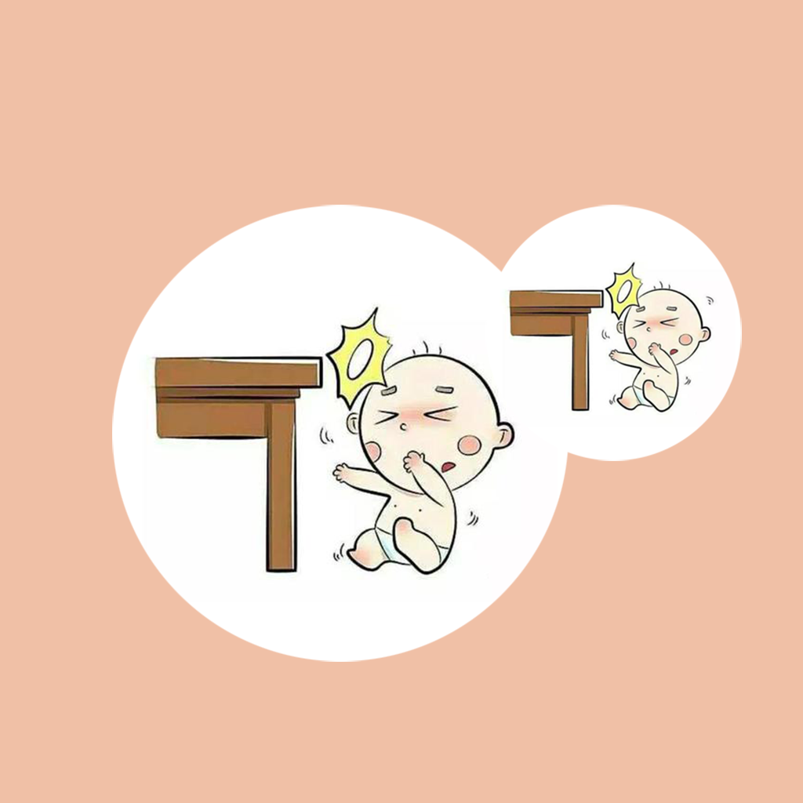

## Welcome to My Baby Bump Injuries Record

In daily life, it is often difficult for babies to avoid injuries caused by hitting obstacles or furniture. For example, you accidentally hit a table while playing at home. Or accidentally stumbled while learning to walk. We should pay attention to our baby's situation, and place furniture or items in the home that are likely to cause a baby's injury to the area where the baby is not easy to touch. At the same time, we can record the position, time and feeling of each time the baby is injured. Put this information together, share and communicate with your baby, let your baby learn to reduce bumps and injuries, and let your baby grow up healthy.

If you have any questions, you can either leave a message or send the questions to our email address.

We will answer them for you in the first time.

### Address: jichungan9498@163.com

Thank you!
